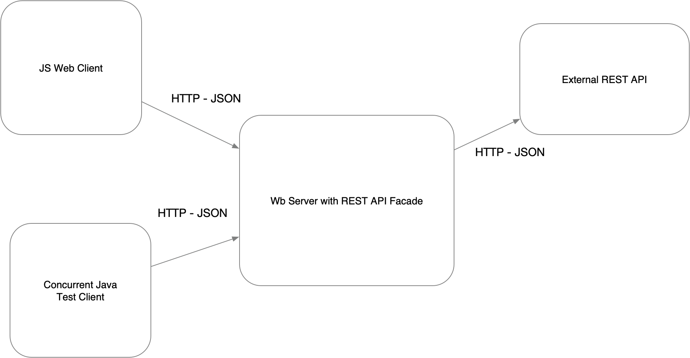

# Lab02-AREP

Este proyecto consiste en un servidor HTTP asíncrono que lee archivos del disco local y los retorna como respuesta a las solicitudes HTTP. También incluye un caché para almacenar respuestas previas y mejorar el rendimiento del servidor.

## Descripción General del Proyecto

La arquitectura del proyecto se basa en un servidor HTTP asíncrono que atiende solicitudes de clientes y retorna archivos del disco local como respuesta. El servidor utiliza múltiples subprocesos para manejar múltiples solicitudes, pero no maneja solicitudes en paralelo. Esto significa que las solicitudes se manejan secuencialmente, una tras otra.

## Implementación del Lector de Archivos en el Disco Local

El lector de archivos en el disco local está implementado en el componente de manejo de solicitudes HTTP. Cuando se recibe una solicitud GET para una determinada ruta, el servidor lee el archivo correspondiente del disco local y retorna su contenido como respuesta HTTP. Tambien implementa un componente de resolucion a peticiones REST para datos relacionados a consultas especificamente de peliculas.

## Arquitectura del Prototipo

El prototipo sigue una arquitectura cliente-servidor, donde el servidor HTTP actúa como el servidor que escucha las solicitudes entrantes de los clientes. El servidor utiliza un enfoque asíncrono para manejar las solicitudes de manera eficiente, utilizando múltiples subprocesos.

## Evaluación y Pruebas

Se realizaron las siguientes pruebas para evaluar el funcionamiento del servidor:

1. Pruebas de Integración:
    - Se enviaron solicitudes HTTP GET para diferentes archivos en el disco local y se verificó que el servidor retornara correctamente el contenido de cada archivo.
    - Se realizaron pruebas con archivos HTML, archivos JavaScript, archivos CSS e imágenes para garantizar que el servidor pudiera manejar diferentes tipos de archivos correctamente.

2. Pruebas de Rendimiento:
    - Se realizaron pruebas de carga simulando múltiples solicitudes concurrentes al servidor para evaluar su rendimiento y capacidad de respuesta.

3. Pruebas de Caché:
    - Se realizaron pruebas para verificar que el servidor utilizara correctamente el caché para almacenar respuestas previas y mejorar el rendimiento.
    - Se evaluó el tiempo de respuesta del servidor antes y después de habilitar el caché para determinar el impacto en el rendimiento.

## Cómo Instalar y Ejecutar el Proyecto

### Requisitos Previos

Asegúrate de tener instalados los siguientes elementos en tu sistema:
- Java Development Kit (JDK): Se debe tener una versión del JDK instalada en el sistema.
- Maven: Se debe tener Maven instalado.

### Pasos para Instalar y Ejecutar

1. **Clonar el Repositorio:** Abrir una terminal y navegar hasta el directorio en el que se desee clonar el repositorio.
2. **Compilar el Proyecto:** Ejecutar `mvn compile`.
3. **Ejecutar el Servidor:** Ejecutar `mvn exec:java -Dexec.mainClass="com.example.genericsLive.HttpServer"`.
4. **Acceder a la Interfaz de Usuario:** Entrar desde un navegador a `http://localhost:35000/formulario.html`.

